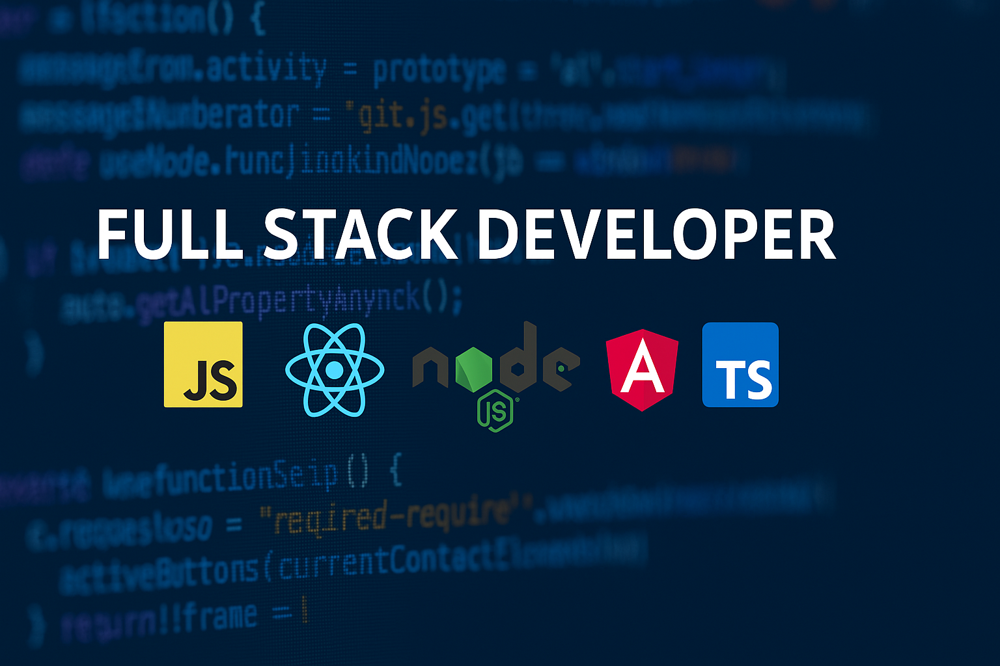

# 👩‍💻 Olesia Kubska – Full Stack Developer

🚀 I am a Junior Full Stack Developer with hands-on experience building full stack applications during intensive training and team-based projects. I bring a creative mindset from my background in arts and music, combined with solid technical skills and proactive collaboration in Agile environments.

---

## 🔧 Tech Stack

#### **Frontend**

#### **Backend**

#### **Databases**

#### **Tools**

#### **AI Integration**

#### **Design**

---

## 🧠 Soft Skills

- Teamwork & Communication  
- Leadership & Decision-making  
- Time Management  
- Problem-solving  

---

## 🌍 Languages

- 🇺🇦 Ukrainian – Native  
- 🇷🇺 Russian – Fluent  
- 🇬🇧 English – Intermediate (B1, improving)  
- 🇵🇱 Polish – Advanced (B2) 

---

## 📂 Portfolio

### 💧 [Water Tracker App](https://water-tracker-app.netlify.app/)
Hydration tracking app using React, Redux Toolkit, Node.js backend, integrated with Swagger.

- [Frontend Repo](https://github.com/YanLozovskyi/water-tracker)
- [Backend Repo](https://github.com/LIGHT131313/WaterTracker_backend)

### 🎬 [Cinemania](https://yanlozovskyi.github.io/project-js-web-anonymous/index.html)
Movie search web app with JavaScript, SCSS, HTML5.

- [GitHub Repo](https://github.com/YanLozovskyi/project-js-web-anonymous)

### 🏨 [MIMINO Hotel](https://vasylkivt.github.io/team-proj-html-css-web-anonymous/restaurant.html)
Built adaptive menu section with HTML/CSS and JavaScript interactivity.

- [GitHub Repo](https://github.com/vasylkivt/team-proj-html-css-web-anonymous)

### 🗓️ [AI Calendar App](http://olesiakubska.github.io/ai-calendar-ui/)
Full-stack calendar with AI integration, built with React, .NET 9, Docker, Render, Tailwind CSS.

- [Frontend](https://github.com/OlesiaKubska/ai-calendar-ui)
- [Backend](https://github.com/OlesiaKubska/AICalendar)

---

## 📜 Certifications

- 🏕️ IT CAMP Workshops - DataArt (2025)
- 🎓 Postgraduate Diploma - Bialystok University of Technology - JavaScript Developer (2024)
- 🧠 Full Stack Developer - IT School GolT, Ukraine (2024)
- 💻 Git, HTTP, SQL Courses - Fundamenta (2024)
- 🇬🇧 English Courses A1–B1 - Study Less, University of Warsaw (2023-2025)
- 🇵🇱 Polish Language Proficiency (B2) - Poland (2023)

---

## 📫 Contact

- 📧 Email: kublesia0908@gmail.com  
- 📞 Phone: +48 795 375 541  
- 🔗 [LinkedIn](http://www.linkedin.com/in/olesia-kubska)  
- 🌐 [Portfolio Website](https://olesiakubska.github.io/olesia-kubska-portfolio)  
- 🐙 GitHub: [@OlesiaKubska](https://github.com/OlesiaKubska)
- 📱 Telegram: [@olesiakubska](https://t.me/olesiakubska)

---

## 📊 GitHub Stats

---

Thank you for visiting my profile! 🌟 Let's build something meaningful together.
